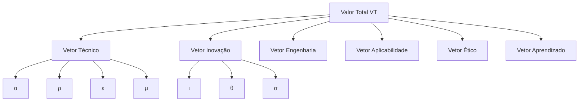

# azykey

Este repositório reúne exemplos, códigos-fonte e documentação para projetos de Visão Computacional e Inteligência Artificial utilizando as principais bibliotecas do Python: OpenCV, PyTorch, scikit-learn e TensorFlow.

## Estrutura do Projeto

- **OpenCV/**: Projetos e exemplos usando OpenCV.
- **PyTorch/**: Projetos e exemplos usando PyTorch.
- **scikit-learn/**: Projetos e exemplos usando scikit-learn.
- **TensorFlow/**: Projetos e exemplos usando TensorFlow.

Cada pasta contém:
- `src/`: Código-fonte principal.
- `examples/`: Exemplos práticos.
- `requirements.txt`: Dependências específicas.
- `README.md`: Documentação da biblioteca.

## Como usar

Escolha a biblioteca desejada, acesse a respectiva pasta e siga as instruções do README correspondente.

---

Sinta-se à vontade para contribuir! 


# Framework de Avaliação de Sistemas de IA

## 🧠 Estrutura Geral

O **Valor Total da IA (VT)** é definido como:

$$
VT = f(\vec{V}\_T, \vec{V}\_I, \vec{V}\_E, \vec{V}\_A, \vec{V}\_\varepsilon, \vec{V}\_L)
$$

Onde:
- $\vec{V}\_T$ = Vetor Técnico
- $\vec{V}\_I$ = Vetor de Inovação
- $\vec{V}\_E$ = Vetor de Engenharia
- $\vec{V}\_A$ = Vetor de Aplicabilidade
- $\vec{V}\_\varepsilon$ = Vetor Ético/Social
- $\vec{V}\_L$ = Vetor de Aprendizado Pessoal

---

## 🧩 1. Vetor Técnico – $\vec{V}\_T$

$$
\vec{V}\_T = \begin{bmatrix}
\alpha & \rho & \epsilon & \mu
\end{bmatrix}
$$

| Componente | Fórmula | Descrição |
|-----------|---------|-----------|
| **Acurácia Média** ($\alpha$) | $$\alpha = \frac{1}{N} \sum_{i=1}^N \text{Acurácia}_i$$ | Média de desempenho em múltiplos datasets |
| **Robustez** ($\rho$) | $$\rho = \frac{\text{Perf}\_{\text{ruído}}}{\text{Perf}\_{\text{limpo}}}$$ | Resiliência a dados perturbados |
| **Eficiência Computacional** ($\epsilon$) | $$\epsilon = \frac{1}{T\_{\text{treino}} \cdot T\_{\text{inférencia}}}$$ | Otimização de recursos computacionais |
| **Cobertura de Modelos** ($\mu$) | $$\mu = \frac{n\_{\text{modelos usados}}}{n\_{\text{modelos disponíveis}}}$$ | Diversidade de abordagens implementadas |

---

## 🚀 2. Vetor de Inovação – $\vec{V}\_I$

$$
\vec{V}\_I = \begin{bmatrix}
\iota & \theta & \sigma
\end{bmatrix}
$$

| Componente | Fórmula | Descrição |
|-----------|---------|-----------|
| **Inovação Arquitetural** ($\iota$) | $$\iota = \frac{n\_{\text{componentes novos}}}{n\_{\text{componentes padrão}}}$$ | Originalidade na estrutura do sistema |
| **Cobertura Tecnológica** ($\theta$) | $$\theta = \frac{n\_{\text{tecnologias emergentes}}}{n\_{\text{tecnologias relevantes}}}$$ | Adoção de técnicas de ponta |
| **Escalabilidade** ($\sigma$) | $$\sigma = \frac{1}{\text{Custo}\_{\text{escalar}}}$$ | Capacidade de crescimento com custos controlados |

---

## 🧱 3. Vetor de Engenharia – $\vec{V}\_E$

$$
\vec{V}\_E = \begin{bmatrix}
L & M & A & D
\end{bmatrix}
$$

| Componente | Fórmula | Descrição |
|-----------|---------|-----------|
| **Legibilidade** ($L$) | $$L = \frac{\text{Linhas}\_{\text{claras}}}{\text{Linhas}\_{\text{totais}}}$$ | Clareza e organização do código |
| **Modularidade** ($M$) | $$M = \frac{1}{\text{Acoplamento}\_{\text{médio}}}$$ | Componentização e reusabilidade |
| **Automação** ($A$) | $$A = \frac{\text{Cobertura}\_{\text{testes}} + \text{Sucesso}\_{\text{CI/CD}}}{2}$$ | Maturidade de pipelines automatizados |
| **Documentação** ($D$) | $$D = \frac{\text{Qualidade}\_{\text{interna}} + \text{Qualidade}\_{\text{externa}}}{2}$$ | Qualidade da documentação técnica |

---

## 📈 4. Vetor de Aplicabilidade – $\vec{V}\_A$

$$
\vec{V}\_A = \begin{bmatrix}
v & u & p
\end{bmatrix}
$$

| Componente | Fórmula | Descrição |
|-----------|---------|-----------|
| **Versatilidade** ($v$) | $$v = \frac{n\_{\text{domínios resolvidos}}}{n\_{\text{domínios testados}}}}$$ | Adaptação a diferentes contextos |
| **UX/UI** ($u$) | $$u \in [0,1]$$ | Experiência do usuário (normalizada) |
| **Preparação para Produção** ($p$) | $$p = \frac{\text{Elementos}\_{\text{prontos}}}{\text{Requisitos}\_{\text{deploy}}}}$$ | Maturidade para implantação |

---

## 🧭 5. Vetor Ético/Social – $\vec{V}\_\varepsilon$

$$
\vec{V}\_\varepsilon = \begin{bmatrix}
\beta & \tau & \pi
\end{bmatrix}
$$

| Componente | Fórmula | Descrição |
|-----------|---------|-----------|
| **Análise de Viés** ($\beta$) | $$\beta = \frac{n\_{\text{métricas justiça}}}{n\_{\text{métricas possíveis}}}}$$ | Mitigação de vieses discriminatórios |
| **Transparência** ($\tau$) | $$\tau = \frac{n\_{\text{XAI}}}{n\_{\text{componentes críticos}}}}$$ | Explicabilidade das decisões |
| **Privacidade** ($\pi$) | $$\pi \in [0,1]$$ | Proteção de dados pessoais |

---

## 📚 6. Vetor de Aprendizado – $\vec{V}\_L$

$$
\vec{V}\_L = \begin{bmatrix}
c & r & k
\end{bmatrix}
$$

| Componente | Fórmula | Descrição |
|-----------|---------|-----------|
| **Conceitos Dominados** ($c$) | $$c = \frac{n\_{\text{conceitos aprendidos}}}{n\_{\text{conceitos estudados}}}}$$ | Domínio teórico adquirido |
| **Resolução de Problemas** ($r$) | $$r = \frac{n\_{\text{desafios resolvidos}}}{n\_{\text{desafios enfrentados}}}}$$ | Habilidade prática desenvolvida |
| **Potencial Criativo** ($k$) | $$k \in [0,1]$$ | Originalidade nas soluções propostas |

---

## 🧮 Agregação do Valor Total

### Norma Euclidiana de Cada Vetor
$$
\left\| \vec{V}\_i \right\| = \sqrt{ \sum\_{j=1}^{n} (v\_{ij})^2 }
$$

### Valor Total Final
$$
VT = \sum_{i=1}^{6} w_i \cdot \left\| \vec{V}\_i \right\|
$$

**Exemplo Prático:**
```python
import numpy as np

# Vetores de exemplo
V_T = np.array([0.9, 0.8, 0.7, 1.0])  # Técnico
V_I = np.array([0.7, 0.9, 0.8])       # Inovação
weights = [0.3, 0.2, 0.15, 0.1, 0.15, 0.1]  # Pesos

# Cálculo da norma
norm_T = np.linalg.norm(V_T)  # ≈ 1.74

# Cálculo do VT (exemplo simplificado)
VT = sum(w * np.linalg.norm(v) for w, v in zip(weights, [V_T, V_I, ...]))
```

---

## 📊 Visualização



---

## 🔚 Conclusão

Este framework permite:
1. Avaliação quantitativa multidimensional
2. Comparação entre versões de sistemas
3. Identificação de pontos fracos prioritários
4. Comunicação padronizada de valor


---

## 🧠 Estrutura Geral

Definimos o **Valor Total da IA (VT)** como uma função de vetores de valor:

$$
VT = f(\vec{V}_T, \vec{V}_I, \vec{V}_E, \vec{V}_A, \vec{V}_\varepsilon, \vec{V}_L)
$$

Onde:

* $\vec{V}_T$ = Vetor Técnico
* $\vec{V}_I$ = Vetor de Inovação
* $\vec{V}_E$ = Vetor de Engenharia
* $\vec{V}_A$ = Vetor de Aplicabilidade
* $\vec{V}_\varepsilon$ = Vetor Ético/Social
* $\vec{V}_L$ = Vetor de Aprendizado Pessoal

Vamos definir cada vetor.

---

## 🧩 1. Vetor Técnico – $\vec{V}_T$

$$
\vec{V}_T = \left[
\text{Acurácia Média}~(\alpha),~
\text{Robustez}~(\rho),~
\text{Eficiência Computacional}~(\epsilon),~
\text{Cobertura de Modelos}~(\mu)
\right]
$$

### Fórmulas:

* Acurácia Média:

  $$
  \alpha = \frac{1}{N} \sum_{i=1}^N \text{Acurácia}_i
  $$
* Robustez:

  $$
  \rho = \frac{\text{Perf}_{\text{ruído}}}{\text{Perf}_{\text{limpo}}}
  $$
* Eficiência Computacional:

  $$
  \epsilon = \frac{1}{T_{\text{treino}} \cdot T_{\text{inférencia}}}
  $$
* Cobertura de Modelos:

  $$
  \mu = \frac{n_{\text{modelos usados}}}{n_{\text{modelos disponíveis}}}
  $$

---

## 🚀 2. Vetor de Inovação – $\vec{V}_I$

$$
\vec{V}_I = \left[
\text{Inovação Arquitetural}~(\iota),~
\text{Cobertura Tecnológica}~(\theta),~
\text{Escalabilidade}~(\sigma)
\right]
$$

* Inovação Arquitetural:

  $$
  \iota = \frac{n_{\text{componentes novos}}}{n_{\text{componentes padrão}}}
  $$
* Cobertura Tecnológica:

  $$
  \theta = \frac{n_{\text{tecnologias emergentes implementadas}}}{n_{\text{tecnologias totais relevantes}}}
  $$
* Escalabilidade:

  $$
  \sigma = \frac{1}{\text{Custo de Escalar (tempo ou recursos)}}
  $$

---

## 🧱 3. Vetor de Engenharia – $\vec{V}_E$

$$
\vec{V}_E = \left[
\text{Legibilidade}~(L),~
\text{Modularidade}~(M),~
\text{Automação}~(A),~
\text{Documentação}~(D)
\right]
$$

* Legibilidade (escala 0–1 baseada em linters ou revisão humana):

  $$
  L = \frac{\text{linhas claras}}{\text{linhas totais}}
  $$
* Modularidade:

  $$
  M = \frac{1}{\text{Acoplamento Médio dos Módulos}}
  $$
* Automação:

  $$
  A = \frac{\text{Cobertura de Testes} + \text{Sucesso em CI/CD}}{2}
  $$
* Documentação:

  $$
  D = \frac{\text{Qualidade Interna} + \text{Qualidade Externa}}{2}
  $$

---

## 📈 4. Vetor de Aplicabilidade – $\vec{V}_A$

$$
\vec{V}_A = \left[
\text{Versatilidade}~(v),~
\text{UX/UI}~(u),~
\text{Preparação para Produção}~(p)
\right]
$$

* Versatilidade:

  $$
  v = \frac{n_{\text{domínios resolvidos}}}{n_{\text{domínios tentados}}}
  $$
* UX/UI:

  $$
  u = \text{Escala qualitativa normalizada entre } [0, 1]
  $$
* Produção:

  $$
  p = \frac{\text{Elementos prontos para produção}}{\text{Total necessário para deploy}}
  $$

---

## 🧭 5. Vetor Ético e Social – $\vec{V}_\varepsilon$

$$
\vec{V}_\varepsilon = \left[
\text{Análise de Viés}~(\beta),~
\text{Transparência/Explicabilidade}~(\tau),~
\text{Privacidade}~(\pi)
\right]
$$

* Análise de Viés:

  $$
  \beta = \frac{n_{\text{métricas de justiça}} \text{ aplicadas}}{n_{\text{possíveis}}}
  $$
* Transparência:

  $$
  \tau = \frac{n_{\text{XAI}}}{n_{\text{componentes críticos}}}
  $$
* Privacidade:

  $$
  \pi = \text{Escala qualitativa de proteção de dados}
  $$

---

## 📚 6. Vetor de Aprendizado Pessoal – $\vec{V}_L$

$$
\vec{V}_L = \left[
\text{Conceitos Dominados}~(c),~
\text{Resolução de Problemas}~(r),~
\text{Potencial Criativo}~(k)
\right]
$$

* Conceitos Dominados:

  $$
  c = \frac{n_{\text{conceitos novos compreendidos}}}{n_{\text{estudados}}}
  $$
* Resolução de Problemas:

  $$
  r = \frac{n_{\text{desafios superados}}}{n_{\text{desafios tentados}}}
  $$
* Potencial Criativo:

  $$
  k = \text{Índice qualitativo de originalidade de soluções}
  $$

---

## 🧮 Valor Total – Agregação Final

Valor Total como uma **média ponderada dos módulos dos vetores**:

$$
VT = \sum_{i=1}^6 w_i \cdot \left\| \vec{V}_i \right\|
$$

Onde:

* $w_i$ são os pesos atribuídos a cada dimensão (ajustáveis conforme prioridade).
* $\left\| \vec{V}_i \right\|$ é a norma Euclidiana do vetor:

$$
\left\| \vec{V}_i \right\| = \sqrt{ \sum_{j=1}^n (v_{ij})^2 }
$$

Exemplo: se $\vec{V}_T = [0.9, 0.8, 0.7, 1.0]$, então:

$$
\left\| \vec{V}_T \right\| = \sqrt{0.9^2 + 0.8^2 + 0.7^2 + 1^2} \approx 1.74
$$

E o Valor Total seria a soma ponderada de todas essas normas:

$$
VT = w_T \cdot \|\vec{V}_T\| + w_I \cdot \|\vec{V}_I\| + \cdots + w_L \cdot \|\vec{V}_L\|
$$

---

### 🧠 Reflexão Final:

Esse modelo permite que você:

* Avalie de forma **quantitativa e qualitativa** sua IA.
* Visualize em **gráficos radar** ou painéis.
* Compare versões ou evoluções do sistema.


